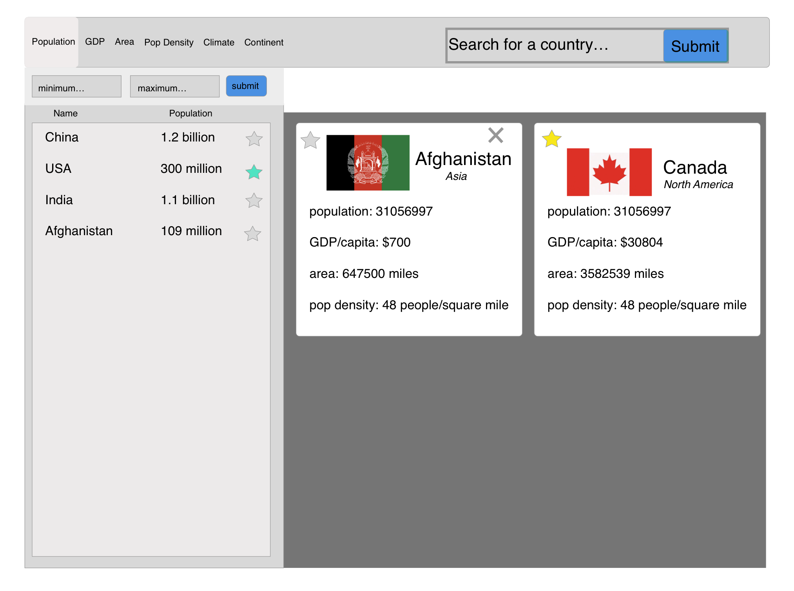

# Nation Navigation

### Abstract:

We built an app in React that utilizes data from the CIA's 'The World Factbook' site. Students or anyone curious about statistics pertaining to any country's population, GDP, or area size would be able to search, favorite, and filter through each and any country and have it displayed in the app. This app would be very convenient for anyone researching for a project or paper.

### Installation Instructions:

Open Your Terminal

Copy and paste the following lines below into your terminal:

```git clone https://github.com/colev1/compare_a_country.git```

```cd compare_a_country/```

```npm install```

```npm install node-sass```

```npm start```


### Project Background:

This project will help us learn how to build React apps and make an api call to pbtain data and then utilize that data. Our data is broken into two datasets and need to be both utilized. This project is also an opportunity for us to build out a program based on user stories.

### Project Goals:

- Write a program from scratch
- Design and implement our app in React using states and props
- Implement ES6 classes
- Implement array iterator and mutator methods to work with the CIA data
- Write modular, reusable code that follows SRP (Single Responibility Principle)

### Design and Layout

##### Our Wireframe:



### Collaboration:

@colev1
@Dhanciles
@jamesb8891

##### DTR link:
